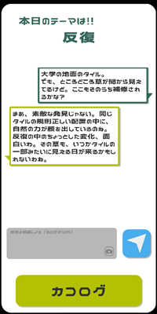
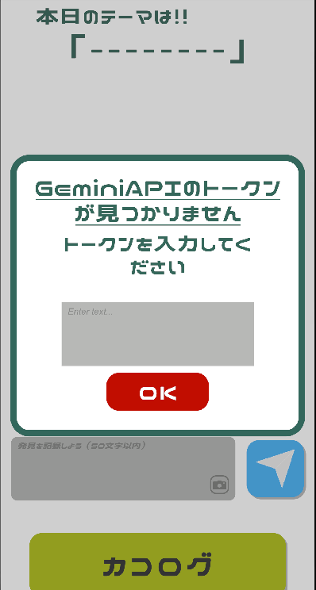

# 発見冒険ログブック

## 概要
Unityを用いて自分用に作成したアプリ。
日々、周囲のモノに意識を向ける機会を増やすべく、カラーバス効果を活用して「発見を記録する」アプリ。
カラーバス効果とは、特定のテーマに注意を向けることで周囲の関連情報に気づきやすくなる心理現象です。
このアプリには、GeminiAPIを利用しています。

## 特徴
- 日々のテーマを自動で決定してくれるため、日々の発見に幅が生まれる
- 発見を書き込むと、AIが褒めたりコメントしてくれるため、継続しやすい
- 過去の履歴をさかのぼれる
- 写真を撮って記録もできる

---

## 開発環境
|項目|内容|
|------|------|
| 開発環境 | Unity 2022.3.49f1 |
| 言語 | C# |
| プラットフォーム | Android |
| 外部ライブラリ | GeminiAPI |

---

## 利用にあたって
初回利用時にGeminiAPIのアクセスキーを入力する必要があります。
個人利用として作成したため、各自でキーの取得・入力を必要とします。

[Google Cloud Console](https://console.cloud.google.com/)
にてGemini API を作成してください

